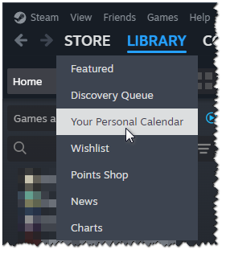

# Personal Calendar Plugin for Millennium

A [Millennium](https://github.com/SteamClientHomebrew/Millennium) plugin that adds a **Your Personal Calendar** link to the **Store** menu between **Discovery Queue** and **Wishlist** in the Steam client.

<p align="center">
  
</p>

The personal calendar feature is too useful to be buried in a submenu in the web store. It should be directly accessible from the client, just one click away. Until Valve adds the link natively, this plugin will do the job.

The plugin uses the native translations already present in the Steam client, so the link should appear in your Steam client's language.


## How to Install

1. Go to the [Releases page](../../releases/latest) and download the latest `io.tsukasa.millenium.personal-calendar.star` file.
2. Place the `.star` file in your Millennium plugin folder.
3. Open your Millennium settings and make sure the "Personal Calendar" plugin is visible and enabled.


## How to Build

To build the plugin, follow the standard `PluginTemplate` instructions for Millennium:

```sh
bun install --frozen-lockfile
bun run build
```

The Millennium plugin package will be created at `dist/io.tsukasa.millennium.personal-calendar.star`.
Copy the `.star` file to your `millennium/plugins` folder, then enable the plugin in Millennium's settings.


## FAQ

**Q: Why is this not available from Millennium's plugin page?**

I cannot be bothered to submit and maintain the plugin. I have no issue putting it on GitHub for people to find, modify, and use; however, I do not want the responsibility that comes with having it listed on an officially curated plugin list.

If that gives you pause, you can inspect the source code yourself to ensure there are no malicious shenanigans. GitHub Actions builds the plugin on every push and publishes releases from tagged commits for transparency.

**Q: Why do some themes show the wrong icon for this menu item?**

This is caused by the way certain themes identify menu items. A workaround is outside the scope of this plugin.
